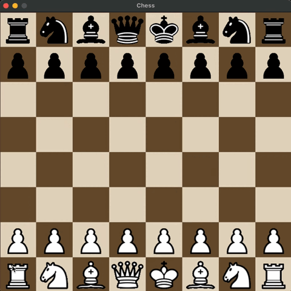

# Chess sandbox

- Written in Rust and OpenGL using glium
- Simple sandbox with movштп the pieces in turn
- No checkmate logic, no castling (yet) but en passant is here :)

## Requirements 

- rustc, cargo (1.67+)

## How to:

`cargo run`
